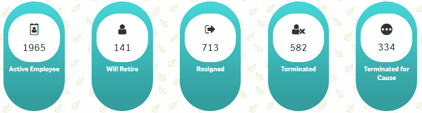

# OvalKPI
<h3>
KPI Settings
</h3>
<ul>
	<li>Header Label : Label for header</li>
	<li>Header CSS : : Standard CSS for Header</li>
	<li>Icon : Icon class is to be added example : lui-icon lui-icon--more-rounded</li>
	<li>Icon Color : color of icon</li>
	<li>Value : Measure code</li>
	<li>Background Color : Custom background color example : #ccc </li>
</ul>
<h1>Demo</h1>

